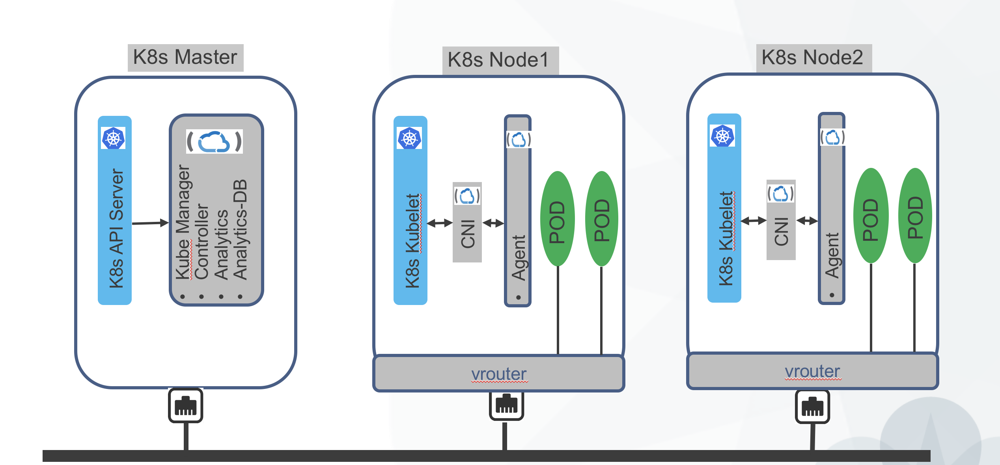

# Contrail + ( Kubernetes / Openshift )

Kubernetes (K8s) is an open source container management platform. It provides a portable platform across public and private clouds. K8s supports deployment, scaling and auto-healing of applications. More details can be found at: http://kubernetes.io/docs/whatisk8s/. 

There is a need to provide pod addressing, network isolation, policy based security, gateway, SNAT, loadalancer and service chaining capability in Kubernetes orchestratation. To this end K8s supports a framework for most of the basic network connectivity. This pluggable framework is called Container Network Interface (CNI). Opencontrail will support CNI for Kubernetes.

Currently K8s provides a flat networking model wherein all pods can talk to each other. Opencontrail will add additional networking functionality to the solution - multi-tenancy, network isolation, micro-segmentation with network policies, load-balancing etc. 

## Deployment Modes - Kubernetes

Contrail provides more than one way of providing networking to a K8s cluster.

### [Standalone Kubernetes](install/kubernetes/standalone-kubernete-ansible.md)
### [Nested Kubernetes](install/kubernetes/nested-kubernetes.md)
### [Non-Nested Kubernetes](install/kubernetes/non-nested-kubernetes.md)

## Deployment Modes - Openshift

### [Standalone Openshift 3.7/3.9](install/openshift/standalone-openshift-3.7.md)
